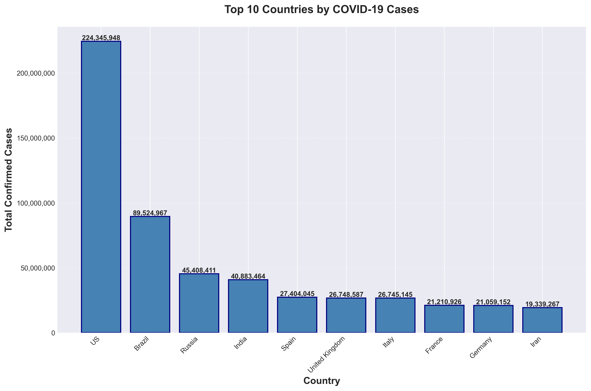
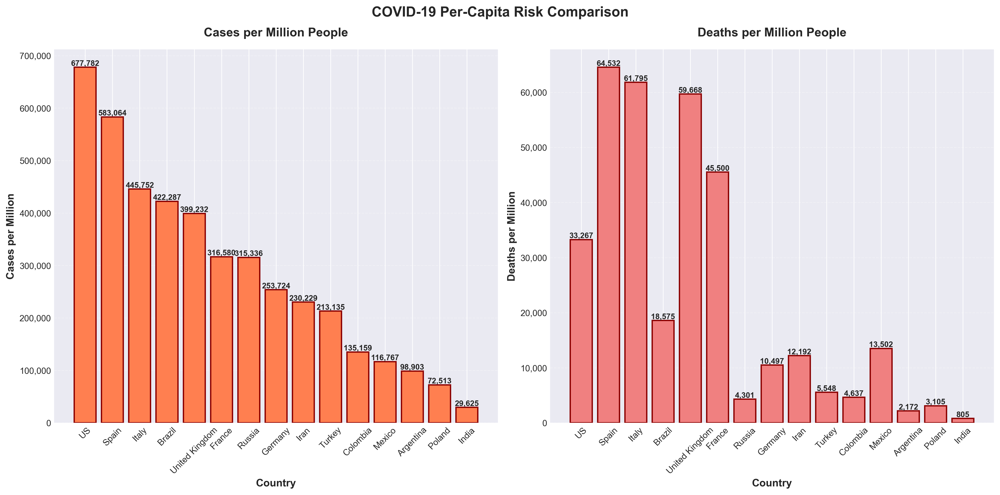

# COVID-19 Data Analysis

Comprehensive analysis of global COVID-19 data to identify trends, high-risk countries, and calculate per-capita metrics.

## Project Overview

This project analyzes COVID-19 data from [Kaggle's COVID-19 Dataset](https://www.kaggle.com/datasets/imdevskp/corona-virus-report) to:

- Clean and process global COVID-19 data (49,068 records)
- Identify high-risk countries based on per-capita metrics
- Calculate country-level aggregations and trends
- Generate actionable insights from pandemic data

---

## Key Results

**Analysis of 49,068 COVID-19 records across 190 countries:**

### Global Statistics

- **Total Confirmed Cases:** 828,508,482
- **Total Deaths:** 43,384,903
- **Total Recovered:** 388,408,229
- **Countries Affected:** 187
- **Case Fatality Rate:** 5.24%
- **Data Span:** 2020-01-22 to 2020-07-27 (187 days)

## Visualizations

### Top 10 Countries by Cases



### Per-Capita Risk Comparison



_Charts generated with Matplotlib showing COVID-19 impact across countries_

_Full results available in `outputs/` folder_

---

## Status

**✅ COMPLETED**

- [x] Project setup
- [x] Data loading and cleaning (34,404 missing values handled)
- [x] Country-level aggregation (190 countries)
- [x] Risk metric calculations (15 countries with population data)
- [x] Summary statistics generation
- [x] Automated data pipeline
- [x] Visualizations

---

## Tech Stack

**Languages & Libraries:**

- **Python 3.9+**
- **Pandas** - Data manipulation and analysis
- **NumPy** - Numerical operations
- **Matplotlib** - Data visualizations (Step 8)

**Skills Demonstrated:**

- Data cleaning & preprocessing
- Aggregation & groupby operations
- Statistical analysis
- Per-capita metric calculations
- Automated data pipelines
- CSV file I/O
- Professional code documentation
- Git version control

---

## Project Structure

```
covid19-analysis/
├── data/                          # Data files (CSV - not committed)
│   └── covid19.csv               # COVID-19 dataset (49,068 rows)
├── src/                           # Source code
│   ├── __init__.py               # Package initialization
│   └── analysis.py               # Main analysis pipeline (6 steps)
├── outputs/                       # Generated results (committed)
│   ├── country_summary.csv       # Country-level statistics (190 countries)
│   └── risk_analysis.csv         # Per-capita risk metrics (15 countries)
├── .gitignore                    # Git ignore rules
├── requirements.txt              # Python dependencies
└── README.md                     # Project documentation
```

---

## Setup

### Prerequisites

- Python 3.9 or higher
- pip package manager

### Installation

1. **Clone the repository**

```bash
   git clone https://github.com/perlathebian/covid19-analysis.git
   cd covid19-analysis
```

2. **Install dependencies**

```bash
   pip install -r requirements.txt
```

3. **Download the dataset**
   - Download from [Kaggle COVID-19 Dataset](https://www.kaggle.com/datasets/imdevskp/corona-virus-report)
   - Extract `covid_19_clean_complete.csv`
   - Place in `data/` folder and rename to `covid19.csv`

---

## Usage

**Run the complete analysis pipeline:**

```bash
python src/analysis.py
```

## Features

### Implemented

- **Data Loading:** Robust CSV loading with path resolution and error handling
- **Data Cleaning:** Handle 34,404 missing values, remove duplicates
- **Country Filtering:** Filter by country name or case threshold
- **Aggregation:** Calculate totals, averages, maximums per country
- **Risk Metrics:** Per-capita calculations (cases/deaths per million)
- **Summary Statistics:** Global totals, averages, case fatality rate, data span
- **Data Export:** Save results as CSV files in outputs/
- **Automated Pipeline:** One-command execution of full 6-step analysis

### Upcoming (Step 8)

- **Visualizations:** Bar charts for top countries
- **Charts:** Cases/deaths per million comparisons

---

## Code Structure

### Main Functions

**Data Loading & Cleaning:**

- `load_data()` - Load CSV with path resolution and error handling
- `clean_data()` - Handle missing values (fillna) and remove duplicates

**Filtering:**

- `filter_country()` - Extract data for specific country
- `filter_high_cases()` - Filter records above case threshold

**Analysis:**

- `aggregate_by_country()` - Calculate country-level statistics using groupby
- `calculate_risk_metrics()` - Compute per-capita metrics (cases/deaths per million)
- `generate_summary_stats()` - Generate global statistics dictionary

**Pipeline:**

- `save_results()` - Export DataFrame to CSV in outputs/
- `main()` - Execute complete 6-step analysis pipeline

## Learning Outcomes

This project demonstrates:

**Technical Skills:**

- Data cleaning and preprocessing (handling NaN, duplicates)
- Pandas operations (filtering, groupby, aggregation, map, merge)
- Statistical analysis (means, totals, per-capita calculations)
- Data pipeline design (modular, reproducible workflow)
- File I/O (CSV reading/writing with Pandas)
- Error handling and validation

**Software Engineering:**

- Modular function design (reusable, composable)
- Type hints and documentation (docstrings for all functions)
- Code organization and structure (logical separation of concerns)
- Git version control (incremental commits, clear messages)
- Professional README documentation

**Data Analysis:**

- Exploratory data analysis (EDA)
- Aggregation and summarization techniques
- Risk assessment metrics (per-capita normalization)
- Insight generation from raw data

---

## Author

**Perla Thebian**

- GitHub: [@perlathebian](https://github.com/perlathebian)
- LinkedIn: [Perla Thebian](https://www.linkedin.com/in/perla-thebian-43a1ab21b/)

---

**Note:** This is a learning project for data analysis practice. Data is for educational purposes only.
